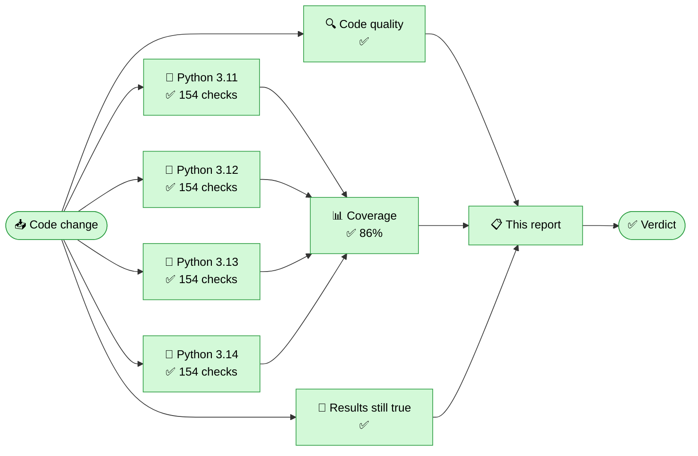

<!-- qa-report -->
# 🛡️ Irreversible Metadata Scrubber — Quality Report

   

  -5f3dc4?style=flat-square)

### ✅ Everything passed — all 616 checks are green

Nothing leaked, no file was damaged, and a scrubbed file still cannot be traced back to the device that made it.

> **What this tool does, in one sentence.** It permanently removes the hidden information a file carries about you — where a photo was taken, which phone took it, when, and what was edited — without changing what the file looks or sounds like.

---

## 🗺️ Where it ran, and where it broke

> Every box is green: the code was checked, the tests ran on every supported version of Python, coverage held, and the published results were re-confirmed from scratch.

---

## 📋 The five-second version

| | Stage | Result | Took | What this checks |
|:--:|---|:--:|--:|---|
| 🔍 | **Code quality** | ✅ 1 issues | 22s | Checks the code itself is tidy and consistent, and that the automation script has no mistakes. |
| 🧪 | **Test suite** | ✅ 616 passed | 3m 16s | Runs every automated check against real files, on four versions of Python. |
| 📊 | **Coverage** | ✅ 85.7% | 19s | Measures how much of the tool's code the tests actually exercise. |
| 🔬 | **Published results still true** | ✅ success | 1m 03s | Re-measures the tool's headline claims and confirms the published results table still matches reality. |

---

## 📊 How much of the tool is tested

*Coverage is the share of the tool's own code that the tests actually run. High coverage means few untested corners where a bug could hide.*

`██████████████████████████░░░░` **85.7%**

> 1,102 of 1,233 lines of the scrubber were exercised by the tests in this run, across Python 3.11, 3.12, 3.13, 3.14.

<b>Coverage file by file</b>

| Part of the tool | Covered | |
|---|--:|---|
| `src/__init__.py` | 100% | `██████████████████` |
| `src/scrub/__init__.py` | 100% | `██████████████████` |
| `src/scrub/__main__.py` | 0% | `░░░░░░░░░░░░░░░░░░` |
| `src/scrub/cli.py` | 77% | `██████████████░░░░` |
| `src/scrub/dispatch.py` | 100% | `██████████████████` |
| `src/scrub/errors.py` | 100% | `██████████████████` |
| `src/scrub/fidelity.py` | 83% | `███████████████░░░` |
| `src/scrub/formats/__init__.py` | 100% | `██████████████████` |
| `src/scrub/formats/base.py` | 92% | `█████████████████░` |
| `src/scrub/formats/jpeg/__init__.py` | 100% | `██████████████████` |
| `src/scrub/formats/jpeg/f1.py` | 84% | `███████████████░░░` |
| `src/scrub/formats/jpeg/f2.py` | 85% | `███████████████░░░` |
| `src/scrub/formats/jpeg/f3.py` | 93% | `█████████████████░` |
| `src/scrub/formats/jpeg/handler.py` | 93% | `█████████████████░` |
| `src/scrub/formats/jpeg/segments.py` | 84% | `███████████████░░░` |
| `src/scrub/formats/mp3/__init__.py` | 100% | `██████████████████` |
| `src/scrub/formats/mp3/f1.py` | 100% | `██████████████████` |
| `src/scrub/formats/mp3/f3.py` | 86% | `███████████████░░░` |
| `src/scrub/formats/mp3/handler.py` | 90% | `████████████████░░` |
| `src/scrub/formats/mp3/walker.py` | 88% | `████████████████░░` |
| `src/scrub/formats/png/__init__.py` | 100% | `██████████████████` |
| `src/scrub/formats/png/chunks.py` | 87% | `████████████████░░` |
| `src/scrub/formats/png/f1.py` | 93% | `█████████████████░` |
| `src/scrub/formats/png/f2.py` | 84% | `███████████████░░░` |
| `src/scrub/formats/png/handler.py` | 88% | `████████████████░░` |
| `src/scrub/standards/__init__.py` | 100% | `██████████████████` |
| `src/scrub/standards/icc.py` | 86% | `████████████████░░` |
| `src/scrub/standards/iptc_iim.py` | 83% | `███████████████░░░` |
| `src/scrub/standards/tiff_ifd.py` | 81% | `███████████████░░░` |
| `src/scrub/standards/xmp.py` | 81% | `███████████████░░░` |

---

## 🧭 What was tested, area by area

| Area | Result | Checks | Took | What it means |
|---|:--:|:--:|--:|---|
| 🧹 **Hidden data removed** | ✅ Pass | 72/72 | 1s | GPS location, camera model, timestamps, embedded thumbnails and comments are stripped so they are gone for good. |
| 🖼️ **Picture and sound preserved** | ✅ Pass | 44/44 | 3s | The file still looks and sounds identical after cleaning — pixel-for-pixel in the lossless modes. |
| 🕵️ **Made untraceable** | ✅ Pass | 88/88 | 23s | You cannot tell which app, camera or phone produced the file — the invisible compression fingerprint is erased. |
| 🔒 **Cannot be recovered** | ✅ Pass | 40/40 | 29s | Forensic recovery tools cannot bring back anything that was removed. |
| 🧩 **File stays valid** | ✅ Pass | 204/204 | 0s | The internal structure and checksums stay correct, so the file still opens everywhere it did before. |
| ⚙️ **The tool behaves** | ✅ Pass | 140/140 | 2m 19s | The command line, automatic file-type detection, fail-safe behaviour and the reporting all work correctly. |
| ✅ **Other checks** | ✅ Pass | 28/28 | 1s | Additional internal quality checks. |

<b>The same results, broken down by Python version</b>

| Area | Py 3.11 | Py 3.12 | Py 3.13 | Py 3.14 |
|---|:--:|:--:|:--:|:--:|
| 🧹 Hidden data removed | ✅ 18 | ✅ 18 | ✅ 18 | ✅ 18 |
| 🖼️ Picture and sound preserved | ✅ 11 | ✅ 11 | ✅ 11 | ✅ 11 |
| 🕵️ Made untraceable | ✅ 22 | ✅ 22 | ✅ 22 | ✅ 22 |
| 🔒 Cannot be recovered | ✅ 10 | ✅ 10 | ✅ 10 | ✅ 10 |
| 🧩 File stays valid | ✅ 51 | ✅ 51 | ✅ 51 | ✅ 51 |
| ⚙️ The tool behaves | ✅ 35 | ✅ 35 | ✅ 35 | ✅ 35 |
| ✅ Other checks | ✅ 7 | ✅ 7 | ✅ 7 | ✅ 7 |

*Every check runs on every version of Python the tool supports, so a future upgrade cannot silently break it.*

---

## 🔬 Published results re-confirmed

✅ This run re-measured the tool's headline results from scratch and they still match the published table exactly. The claims in this report are not cached — they were just proven again.

---

## 🎯 What the tool can promise today

*Read straight from the measured results files in this repository. If a claim here is not backed by a real measurement, it does not appear.*

| Format | Removes hidden data | Keeps the file identical | Makes it untraceable |
|---|:--:|:--:|:--:|
| **JPEG (photos)** | ✅ Yes | ✅ Yes | ✅ Yes — a tiny, invisible quality cost |
| **PNG (graphics / screenshots)** | ✅ Yes | ✅ Yes | ✅ Yes — no quality loss |
| **MP3 (audio)** | ✅ Yes | ✅ Yes | ✅ Yes — a tiny, invisible quality cost |

<b>The full measured grid, and what the words mean</b>

| Format | Snoop | Bit-preserving (F1) | Lossless (F2) | Lossy (F3) |
|---|---|:--:|:--:|:--:|
| JPEG (photos) | Metadata snoop | ✅ beaten | ✅ beaten | ✅ beaten |
| JPEG (photos) | Fingerprint snoop | ❌ still traceable | ❌ still traceable | ✅ beaten |
| PNG (graphics / screenshots) | Metadata snoop | ✅ beaten | ✅ beaten | — n/a |
| PNG (graphics / screenshots) | Fingerprint snoop | ❌ still traceable | ✅ beaten | — n/a |
| MP3 (audio) | Metadata snoop | ✅ beaten | — n/a | ✅ beaten |
| MP3 (audio) | Fingerprint snoop | ❌ still traceable | — n/a | ✅ beaten |

**The two snoops**

- **The metadata snoop** reads the hidden tags directly — GPS coordinates, camera model, timestamps, the little preview thumbnail, comments.
- **The fingerprint snoop** never reads a tag. It works out which app or device made the file from *how* the file was compressed — like recognising a typewriter from the dents it leaves in paper.

**The three cleaning strengths**

- **F1 — bit-preserving:** delete every tag; the picture or audio data is left byte-for-byte untouched. No quality cost.
- **F2 — lossless re-encode:** delete every tag *and* repack the compression. Still perfect quality.
- **F3 — lossy re-encode:** re-compress through one standard encoder so every file comes out looking the same to a forensic tool. Tiny, invisible quality cost.

---

## 🚧 What the tool cannot do yet — and what we do about it

*The honest part. Each row is a limit in plain words, then what we do about it. Read straight from `docs/limits.md`, the single place these are recorded, so it cannot quietly fall out of date.*

| # | The honest limit (plain words) | What we do about it | Status |
|:-:|---|---|:--:|
| **1** | Even after every tag is deleted, the *way* a file was compressed leaves a hidden signature that can hint which app, phone or program made it. | We re-save through **one standard encoder** so every file we produce shares the same signature: **JPEG** at F3, **MP3** at F3, and **PNG** at F2 **with no quality loss at all**. For MP3 this is now proven against a genuinely *different* encoder, not just a different program using the same one. | ✅ **Solved** |
| **2** | Our "every file comes out looking the same" promise is **not one single group**. Low-quality-rate audio can't legally use our standard setting, so it comes out at a different one — a handful of groups, not one. Someone can see *which* group a file belongs to. | **Deliberate, and measured.** The group is decided by the recording's own sample rate, which we **preserve on purpose** — changing it would alter the audio, and keeping the sound untouched matters more. What must not leak is *who made the file*, and that is tested **inside every group separately**: at both 44.1 kHz and 22.05 kHz, no producer can be told from another after F3, in the file's structure **and** in its sound. | ✅ **Solved per group** |
| **3** | Some unusual audio files we **refuse to process at all**: older Layer II audio wearing an `.mp3` name, and files using a rare "free-format" bitrate. | The tool **fails closed** — it stops rather than write a file it cannot fully vouch for. Nothing leaks, but the user gets no output. Broader format support is planned. | 🟡 **Safe but incomplete** |
| **4** | Making a file untraceable means **re-recording** it, and that always costs something: a high-quality audio file loses some quality, and a very small file can come out several times **larger**. | An unavoidable trade of this approach, stated up front rather than hidden. The alternative — keeping the original audio untouched — is exactly what leaves the traceable signature in place. | 🟡 **Bounded trade-off** |
| **5** | Every camera sensor leaves a faint, unique **noise pattern baked into the pixels** (PRNU). Audio has the same problem: every **microphone and room** leaves a fingerprint, and mains electricity hums at a frequency that can date a recording. | These live **in the picture and in the sound itself**, not in the metadata — removing them would destroy the content. They are a known limit of **every tool that exists** and sit outside our medium-tier threat model. We document them openly. | ⚪ **Out of scope** |
| **6** | A **more sophisticated investigator** than the one we built might still succeed. Our audio test inspects the sound's frequency profile; published research also inspects the encoder's internal number-crunching, which we have **not** tested against. | We report what we measured and what we did not. We do **not** claim to survive attacks we never ran — the untested methods are named so the gap is visible rather than implied away. | 🔴 **Untested** |
| **7** | Two things are **not built yet**: a second style of audio VBR header used by some encoders is unhandled and untested, and **M4A** and **FLAC** audio aren't supported at all. | On the roadmap. M4A matters because the main comparable tool refuses it outright — a gap we can beat rather than match. | 🔜 **Planned** |
| **8** | We currently handle **JPEG, PNG and MP3**. | Next, on the same tested foundation: 📄 documents (PDF / Word) → 🎬 video (MP4) → 📷 camera RAW. Each ships only when its differential tests pass. | 🔜 **Planned** |

🧪 <b>Where the evidence lives — the technical residuals, for the curious</b>

- **DQT (JPEG quantization tables):** the F1/F2 fingerprint source — neutralised at F3 via a single standard encoder.
- **LAME/Xing header + bitrate contour (MP3):** the audio equivalent — survives F1, normalised at F3.
- **Cross-engine audio trace (MP3):** measured, not assumed. A classifier that identifies the source encoder from the sound alone scores **0.94 on untouched and F1 files, and chance (0.50) after F3**. Peer set includes `shineenc`, an encoder that is not libmp3lame. Scope: frequency-profile features; MDCT-domain classifiers untested (limit #6).
- **Anonymity groups (MP3 F3):** the standard 192 kbps setting is illegal for MPEG-2 sample rates, so those files emit at 160 kbps instead — separate groups (limit #2). Producer-anonymity is verified **within each group**, in header space (E-LAME, both rates pass) and in audio space (E-ENGINE: 44.1 kHz 0.94 → 0.50, 22.05 kHz 1.00 → 0.61, against chance 0.50). The group boundary follows the source's sample rate, which is content, not a producer trait.
- **PRNU (sensor noise) / microphone + room response / mains hum:** structural impossibilities; documented, out of scope (limit #5).
- **Primary-quantization estimate:** the bounded "was re-saved" hint after F3 — reveals nothing about original metadata.
- **Scrubber-fingerprint guard:** confirms our *own* tool leaves no producer/creator string, no odd padding, deterministic ordering, and no modification-time stamping.

> **The principle:** we never claim a file is untraceable unless we have actually proven it. Where a limit is a law of physics, we say so rather than pretend it is solved.

---

## 🔍 Code quality

⚠️ 1 issue(s) found.

<b>Breakdown by rule</b>

| Rule | Times |
|---|--:|
| `I001` | 1 |

---

## ⏱️ Timing

<b>The ten slowest checks</b>

| Check | Took |
|---|--:|
| MP3 matrix builds and validates | 30.17s |
| MP3 matrix builds and validates | 30.17s |
| MP3 matrix builds and validates | 30.17s |
| MP3 matrix builds and validates | 30.17s |
| Controls recover the engine | 6.80s |
| Controls recover the engine | 6.80s |
| Controls recover the engine | 6.80s |
| Controls recover the engine | 6.80s |
| Matrix builds and validates | 2.35s |
| Matrix builds and validates | 2.35s |

Total time spent running checks, added up across every Python version: **3m 16s**.

---

## 🔍 Before and after, on real files

<b>Show what actually came off a real file — tags, thumbnails, encoder fingerprint, before vs after</b>

Synthetic samples with planted metadata (no real user data). Each is shown **before → after** scrubbing across fidelity tiers.

### JPEG sample

**Before scrub** — 18 metadata tags incl. Comment, GPSLatitude, GPSLatitudeRef, GPSLongitude, GPSLongitudeRef, GPSPosition

| Fidelity | Metadata tags | Embedded thumbnails | Trailer bytes | File size | Encoder DQT (raw→scrubbed) | Result |
|---|---|---|---|---|---|---|
| F1 | 18 → **0** | 0 | 0 | 2,895 → 1,504 B | `931afd906e`→`931afd906e` | ✅ clean |
| F2 | 18 → **0** | 0 | 0 | 2,895 → 1,036 B | `931afd906e`→`931afd906e` | ✅ clean |
| F3 | 18 → **0** | 0 | 0 | 2,895 → 1,001 B | `931afd906e`→`cc9ad4edd6` | ✅ clean |

### PNG sample

**Before scrub** — 3 metadata tags incl. Author, GPS, Software

| Fidelity | Metadata tags | Trailer bytes | File size | Result |
|---|---|---|---|---|
| F1 | 3 → **0** | 0 | 237 → 146 B | ✅ clean |
| F2 | 3 → **0** | 0 | 237 → 146 B | ✅ clean |

### A2 fingerprint defense (JPEG)

Same image, three producers. F1/F2 keep each producer's DQT (traceable); F3 re-compresses so all share one DQT (untraceable).

| Producer | DQT raw | DQT after F1 | DQT after F3 |
|---|---|---|---|
| encoderA_q92 | `931afd906e` | `931afd906e` | `cc9ad4edd6` |
| encoderB_q75 | `f516966307` | `f516966307` | `cc9ad4edd6` |
| encoderC_q60 | `95eb13cc9f` | `95eb13cc9f` | `cc9ad4edd6` |

**✅ all producers share ONE DQT after F3 — fingerprint erased**

_F1 bit-preserving · F2 lossless re-encode · F3 lossy re-encode. A ✅ result means zero metadata tags, no embedded thumbnail, and no trailer bytes survive._

---

Commit <code>local</code> · branch <code>local</code> · 616 checks on Python 3.11, 3.12, 3.13, 3.14 · ground truth verified with ExifTool · adversary model: medium-tier (A2) · regenerated automatically on every change
