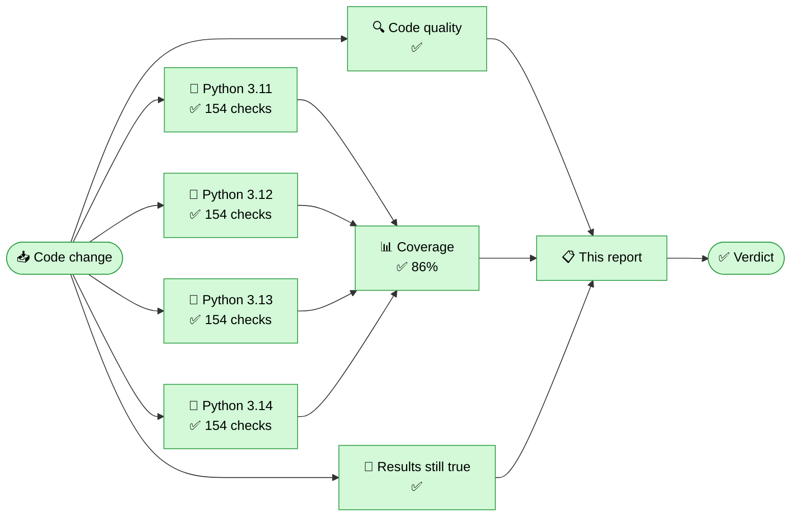

<!-- qa-report -->
# 🛡️ Irreversible Metadata Scrubber — Quality Report

   

  -5f3dc4?style=flat-square)

### ✅ Everything passed — all 616 checks are green

Nothing leaked, no file was damaged, and a scrubbed file still cannot be traced back to the device that made it.

> **What this tool does, in one sentence.** It permanently removes the hidden information a file carries about you — where a photo was taken, which phone took it, when, and what was edited — without changing what the file looks or sounds like.

---

## 🗺️ Where it ran, and where it broke

> Every box is green: the code was checked, the tests ran on every supported version of Python, coverage held, and the published results were re-confirmed from scratch.

---

## 📋 The five-second version

| | Stage | Result | Took | What this checks |
|:--:|---|:--:|--:|---|
| 🔍 | **Code quality** | ✅ 1 issues | 22s | Checks the code itself is tidy and consistent, and that the automation script has no mistakes. |
| 🧪 | **Test suite** | ✅ 616 passed | 3m 16s | Runs every automated check against real files, on four versions of Python. |
| 📊 | **Coverage** | ✅ 85.7% | 19s | Measures how much of the tool's code the tests actually exercise. |
| 🔬 | **Published results still true** | ✅ success | 1m 03s | Re-measures the tool's headline claims and confirms the published results table still matches reality. |

---

**Coverage:** `██████████████████████████░░░░` **85.7%**

---

📋 The full report — area-by-area results, what the tool can promise for each file type, its honest limits, and before/after evidence on real files — is on the [Actions run page](#).
