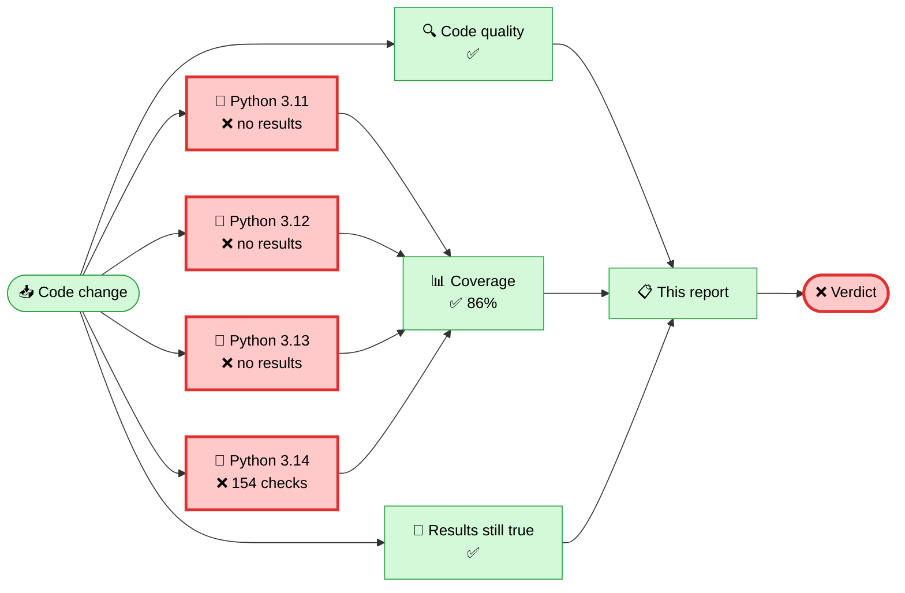

<!-- qa-report -->
# 🛡️ Irreversible Metadata Scrubber — Quality Report

   

  -5f3dc4?style=flat-square)

### ❌ Something needs attention

**4 of 154 checks failed** and Python **3.11**, **3.12**, **3.13** reported no results at all and the **test** stage reported a problem. Start with *Where it ran, and where it broke* just below.

> **What this tool does, in one sentence.** It permanently removes the hidden information a file carries about you — where a photo was taken, which phone took it, when, and what was edited — without changing what the file looks or sounds like.

---

## 🗺️ Where it ran, and where it broke



> ❌ **The red boxes are where the problem is.** Failing stage(s): **test**. 4 individual check(s) failed — each one is listed under *What failed*, and flagged inline on the offending line of code.

---

## 📋 The five-second version

| | Stage | Result | Took | What this checks |
|:--:|---|:--:|--:|---|
| 🔍 | **Code quality** | ✅ clean | — | Checks the code itself is tidy and consistent, and that the automation script has no mistakes. |
| 🧪 | **Test suite** | ❌ 4 failed | 34s | Runs every automated check against real files, on four versions of Python. |
| 📊 | **Coverage** | ✅ 85.5% | — | Measures how much of the tool's code the tests actually exercise. |
| 🔬 | **Published results still true** | ✅ success | — | Re-measures the tool's headline claims and confirms the published results table still matches reality. |

---

## ❌ What failed

*4 check(s) did not pass. Each one is also flagged inline on the affected line of code in the pull request, so it is easy to find.*

<details open>
<summary><b>Show all 4 failure(s)</b></summary>

#### ❌ Limits doc exists and is parseable

- **Where:** `tests.scrub.test_qa_report_limits.test_limits_doc_exists_and_is_parseable`
- **Affects Python:** 3.14
- **Internal name:** `test_limits_doc_exists_and_is_parseable`

```text
AttributeError: module &#x27;qa_report&#x27; has no attribute &#x27;load_limits&#x27;. Did you mean: &#x27;load_timings&#x27;?
```

#### ❌ Report embeds the limits rather than its own copy

- **Where:** `tests.scrub.test_qa_report_limits.test_report_embeds_the_limits_rather_than_its_own_copy`
- **Affects Python:** 3.14
- **Internal name:** `test_report_embeds_the_limits_rather_than_its_own_copy`

```text
AttributeError: module &#x27;qa_report&#x27; has no attribute &#x27;load_limits&#x27;. Did you mean: &#x27;load_timings&#x27;?
```

#### ❌ Missing limits doc is reported not hidden

- **Where:** `tests.scrub.test_qa_report_limits.test_missing_limits_doc_is_reported_not_hidden`
- **Affects Python:** 3.14
- **Internal name:** `test_missing_limits_doc_is_reported_not_hidden`

```text
AttributeError: module &#x27;qa_report&#x27; has no attribute &#x27;render_markdown&#x27;
```

#### ❌ Known open limits are actually documented

- **Where:** `tests.scrub.test_qa_report_limits.test_known_open_limits_are_actually_documented`
- **Affects Python:** 3.14
- **Internal name:** `test_known_open_limits_are_actually_documented`

```text
AttributeError: module &#x27;qa_report&#x27; has no attribute &#x27;load_limits&#x27;. Did you mean: &#x27;load_timings&#x27;?
```


</details>

---

**Coverage:** `██████████████████████████░░░░` **85.5%**

---

<sub>📋 The full report — area-by-area results, what the tool can promise for each file type, its honest limits, and before/after evidence on real files — is on the [Actions run page](#).</sub>
